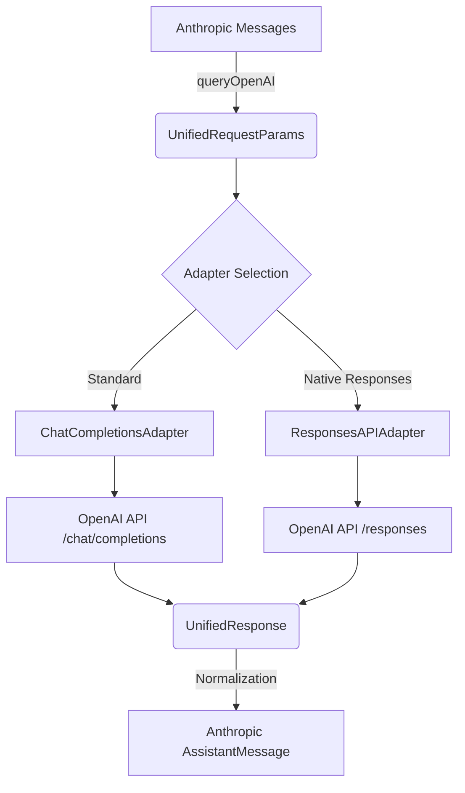

# OpenAI Adapter Layer

This module enables Kode's Anthropic-first conversation engine to seamlessly interact with OpenAI-compatible providers. It selectively routes requests through either the standard Chat Completions API or the new Responses API without exposing provider complexity to the rest of the system.

The adapter layer activates when `USE_NEW_ADAPTERS !== 'false'` and a valid `ModelProfile` is configured.

## Architecture

The adapter layer acts as a translation bridge, preserving Anthropic data structures internally while communicating with various external providers.



## Core Concepts

### Unified Data Structures

To maintain provider neutrality, the system uses intermediate data structures defined in [`src/types/modelCapabilities.ts`](file:///Users/ruonan/repo/kode/Kode-cli/src/types/modelCapabilities.ts).

#### UnifiedRequestParams
```typescript
interface UnifiedRequestParams {
  messages: any[]           // OpenAI-format messages
  systemPrompt: string[]    // Preserved system prompts
  tools: Tool[]             // Abstract tool definitions
  maxTokens: number
  stream: boolean
  reasoningEffort?: string  // 'low' | 'medium' | 'high'
  verbosity?: string        // 'concise' | 'verbose'
  previousResponseId?: string
}
```

#### UnifiedResponse
```typescript
interface UnifiedResponse {
  id: string
  content: any[]            // Normalized content blocks
  toolCalls: any[]          // Normalized tool calls
  usage: {
    promptTokens: number
    completionTokens: number
    reasoningTokens?: number
  }
  responseId?: string       // For stateful follow-ups
}
```

## Request Flow

1.  **Normalization (`src/services/claude.ts`)**
    *   Converts Anthropic message history to OpenAI format.
    *   Flattens system prompts while preserving structure.
    *   Builds the `UnifiedRequestParams` bundle.

2.  **Adapter Selection (`ModelAdapterFactory`)**
    *   Inspects `ModelProfile` and capabilities.
    *   Selects `ChatCompletionsAdapter` for standard providers.
    *   Selects `ResponsesAPIAdapter` for providers supporting the new Responses API.

3.  **Request Construction**

    | Feature | Chat Completions Adapter | Responses API Adapter |
    | :--- | :--- | :--- |
    | **Endpoint** | `/chat/completions` | `/responses` |
    | **Message Format** | Single list with system messages | `input` array with typed items |
    | **Tools** | `tools` array (JSON Schema) | Flat `tools` list |
    | **Streaming** | Optional `stream: true` | Always enabled |
    | **Reasoning** | `reasoning_effort` param | `include: ['reasoning.encrypted_content']` |

## Response Flow

Both adapters normalize provider-specific responses into the `UnifiedResponse` format.

### Chat Completions
*   Extracts content from `choices[0].message`.
*   Normalizes standard usage statistics.
*   Handles standard function calling format.

### Responses API
*   **Streaming**: Incrementally decodes SSE chunks.
*   **JSON**: Folds `output` message items into text blocks.
*   **State**: Captures `response.id` for stateful conversational continuity.

## Extension Guide

### Adding a New Provider
If a new provider follows standard OpenAI conventions, simply add a new `ModelProfile`. If it requires custom handling:

1.  Define capabilities in [`src/constants/modelCapabilities.ts`](file:///Users/ruonan/repo/kode/Kode-cli/src/constants/modelCapabilities.ts).
2.  Extend `ModelAPIAdapter` if the protocol is significantly different.
3.  Register the new adapter in `ModelAdapterFactory`.

### Handling Model Quirks
Keep model-specific logic (like `o1` unsupported fields) inside the specific adapter's `createRequest` method. This keeps the core logic clean and provider-agnostic.

## Non-Obvious Design Patterns

### 1. Adapter Pattern for API Compatibility
- **What it looks like**: Code duplication across adapters (e.g., `chatCompletions.ts` vs `responsesAPI.ts`).
- **Why it's intentional**: Responses API and Chat Completions are fundamentally different protocols. Separate adapters provide clarity, type safety, and independent evolution at the cost of some duplication.
- **When to use**: When supporting multiple versions/formats of an API where a single abstraction would be leaky or overly complex.

### 2. Multi-Model Architecture
- **What it looks like**: Complex model management with profiles and pointers (`ModelManager`).
- **Why it's intentional**: Different models excel at different tasks (reasoning vs coding vs speed). This allows optimal model selection for each job.
- **When to use**: When you need to leverage the specific strengths of multiple AI models within a single workflow.

## Maintenance Tips

### Adding a New Model
1.  Add capability definition in `src/constants/modelCapabilities.ts`.
2.  Add to `MODEL_CAPABILITIES_REGISTRY`.
3.  Add default profile in `src/constants/models.ts`.
4.  Test with integration test (`src/test/integration/integration-cli-flow.test.ts`).

### Modifying Responses API Request
-   Edit `src/services/adapters/responsesAPI.ts`.
-   Run unit tests: `bun test src/test/unit/responses-api-e2e.test.ts`.
-   Run integration test: `bun test src/test/integration/integration-cli-flow.test.ts`.
-   Run production test: `PRODUCTION_TEST_MODE=true bun test src/test/unit/responses-api-e2e.test.ts`.

